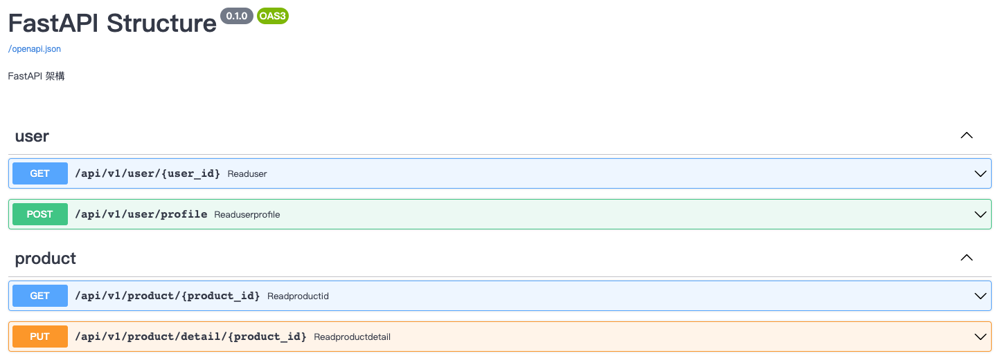

# FastAPI Structure
此 Repo 提供一個開發 FastAPI 的樣板，僅供參考。

```
.
├── api
│   ├── api_v1
│   │   ├── endpoints
│   │   │   ├── product
│   │   │   │   └── product.py
│   │   │   └── user
│   │   │       └── user.py
│   │   └── api.py
│   └── deps.py
├── db
│   └── database.py
├── models
│   ├── product.py
│   └── user.py
├── schemas
│   ├── product.py
│   └── user.py
├── tests
│   └── v1
│       ├── test_product.py
│       └── test_user.py
├── Dockerfile
├── README.md
├── config.py
├── main.py
└── requirements.txt
```

 * api
    * api_v1
        * endpoints
            * product
                * product.py：有關 product 的 API router
            * user
                * user.py：有關 user 的 API router
        * api.py：整合 v1 所有的 API router
    * deps.py：依賴項
* db
    * database.py：資料庫設定
* models
    * product.py：資料庫中 product 表格的對應欄位設定
    * user.py：資料庫中 user 表格的對應欄位設定
* schemas
    * product.py：有關 product 的 pydantic model
    * user.py：有關 user 的 pydantic model
* tests
    * v1
        * test_product.py：product.py 測試檔
        * test_user.py：user.py 測試檔
* config.py：設定檔
* main.py：整個 project 的設定 (如 CORS 等)

## Run
```
docker build -t fastapi_structure .
docker run -d --name fastapi_structure -p 9527:80 fastapi_structure
```

## Interactive API docs
[http://0.0.0.0:9527/docs](http://0.0.0.0:9527/docs)



## Reference
[FastAPI - Project Generation - Template](https://fastapi.tiangolo.com/project-generation/)