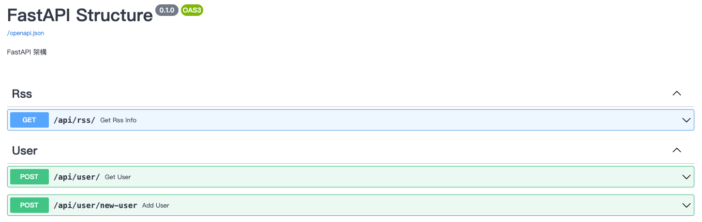

# FastAPI Structure
此Repo提供一個開發FastAPI的基礎公版。

* api: 存放所有與API相關的檔案
    * endpoints: 存放設定API router的相關檔案
        * products: 存放有關product的API router及其相關檔案
        * users: 存放有關user的API router及其相關檔案
    * api.py: 整合所有API router
* database: 存放與資料庫相關的檔案
    * db.py: 設定資料庫
* models: 存放所有pydantic model
    * products.py: 設定有關product的model(取名與endpoints內檔案一致)
    * users.py: 設定有關user的model(取名與endpoints內檔案一致)
* tests: 存放所有測試檔案
    * test_products.py: 測試products.py
    * test_users.py: 測試users.py
* main.py: 整個project的設定(如CORS等)

## Interactive API docs

## Reference
[FastAPI - Project Generation - Template](https://fastapi.tiangolo.com/project-generation/)